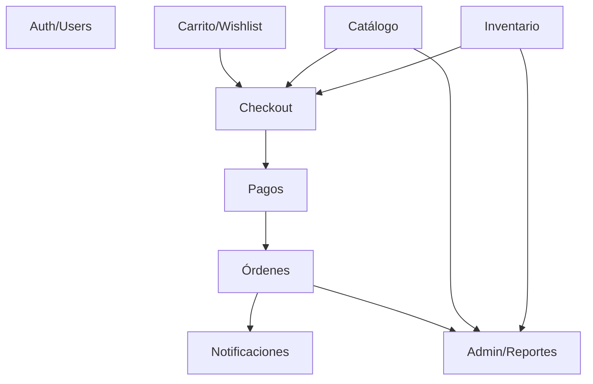
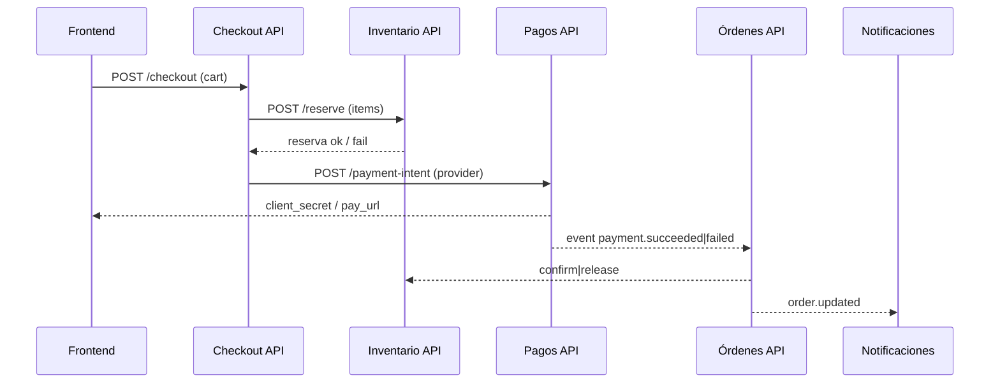
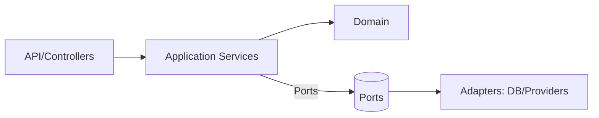

# Arquitectura Hexagonal (Clean Architecture++ para Barbaro)

## Principios
- Separar dominios y aislar dependencias externas via puertos/adaptadores.
- Contratos tipados y versionados (HTTP + eventos) para evitar acoplamientos.
- Frontend feature-first consumiendo sólo contratos publicados.
- Observabilidad y resiliencia: idempotencia en pagos/órdenes, timeouts/reintentos en integraciones.

## Dominios
- **Auth/Usuarios**: identidad, roles, perfil; publica eventos de usuario creado/actualizado.
- **Catálogo**: productos, variantes, categorías, precios base; no conoce carrito ni pedidos.
- **Inventario**: stock y reservas; expone `check/reserve/release`.
- **Carrito/Wishlist**: estado efímero por usuario; no calcula impuestos/pagos.
- **Checkout/Orquestación**: valida carrito, precios vigentes, stock, promociones; crea intención de cobro.
- **Órdenes**: lifecycle (`pending/paid/shipped/...`), idempotencia por `order_id`.
- **Pagos**: interfaz `PaymentProvider` (stripe|mercadopago|shopify-payments|…); adaptadores aislados.
- **Notificaciones**: email/push; suscriptor de eventos `order.*`, `payment.*`.
- **Admin/Reportes**: lecturas agregadas, sin escribir en dominios núcleo.

## Capas por servicio (puertos y adaptadores)
- **API (interface)**: controladores HTTP (REST v1), validación (zod), authz.
- **Aplicación**: casos de uso, orquestación, políticas; sin dependencias de infra.
- **Dominio**: entidades y lógica pura.
- **Infra/Adaptadores**: DB, providers externos (Shopify, pago, email), cache, colas.

## Esquema de carpetas sugerido
```
supabase/
  functions/
    catalog-api/        # controladores REST
    catalog-core/       # casos de uso + dominio
    catalog-adapters/   # db/shopify adapters
    inventory-api/
    inventory-core/
    inventory-adapters/
    payments-api/
    payments-core/
    payments-adapters/
    orders-api/
    orders-core/
    orders-adapters/
shared/
  contracts/           # DTOs, eventos, zod schemas (comunes API/FE)
  utils/               # logger, http client, error helpers
src/
  features/
    catalog/
    cart/
    checkout/
    orders/
    payments/
    account/
  shared/
    api/               # clientes HTTP por dominio
    components/
    lib/
```

## Diagramas (Mermaid)

### Mapa de dominios


### Flujo de checkout/pagos


### Capas (hexágono simplificado)


## Contratos y versionado
- REST v1: `/api/v1/<dominio>/...`.
- Eventos de dominio con schema (`payment.succeeded`, `order.paid`).
- Contratos en `shared/contracts` (TypeScript + zod) reutilizados por FE y funciones.

## Datos y consistencia
- Un Postgres con **esquemas** por dominio (`catalog`, `inventory`, `orders`, `payments`, `users`).
- Transacciones sólo dentro del dominio; coordinación entre dominios via eventos.
- Vistas de lectura para Admin/Reportes; no exponer joins crudos a servicios de escritura.

## Pagos extensibles
1) Implementar nuevo adaptador `PaymentProvider` en `payments-adapters/<provider>.ts`.
2) Registrar en tabla `payment_providers` (enabled, keys, fees).
3) No tocar Checkout ni Órdenes; sólo config + adaptador.

## Frontend feature-first
- Cada feature expone: `api/`, `components/`, `hooks/`, `types/`.
- API clients hablan sólo con rutas de su dominio.
- Estado global mínimo (auth, theme, cart token); resto en feature stores.

## Observabilidad y resiliencia
- Correlation-id por request; logs estructurados.
- Idempotencia en pagos/órdenes (keys por intent y order_id).
- Timeouts/retries con backoff en integraciones externas.
- Circuit breakers para proveedores de pago/email.

## Roadmap de migración (incremental)
1) Extraer `shared/contracts` y tipar respuestas actuales.
2) Separar Catálogo/Inventario en funciones dedicadas con esquemas propios.
3) Servicio Pagos con interfaz + adaptador actual; mover webhooks ahí.
4) Orquestador Checkout que consume Catálogo/Inventario/Pagos; Órdenes escucha eventos de pago.
5) Notificaciones como consumidor de eventos.
6) Frontend a `src/features/*` y clientes HTTP por dominio.
