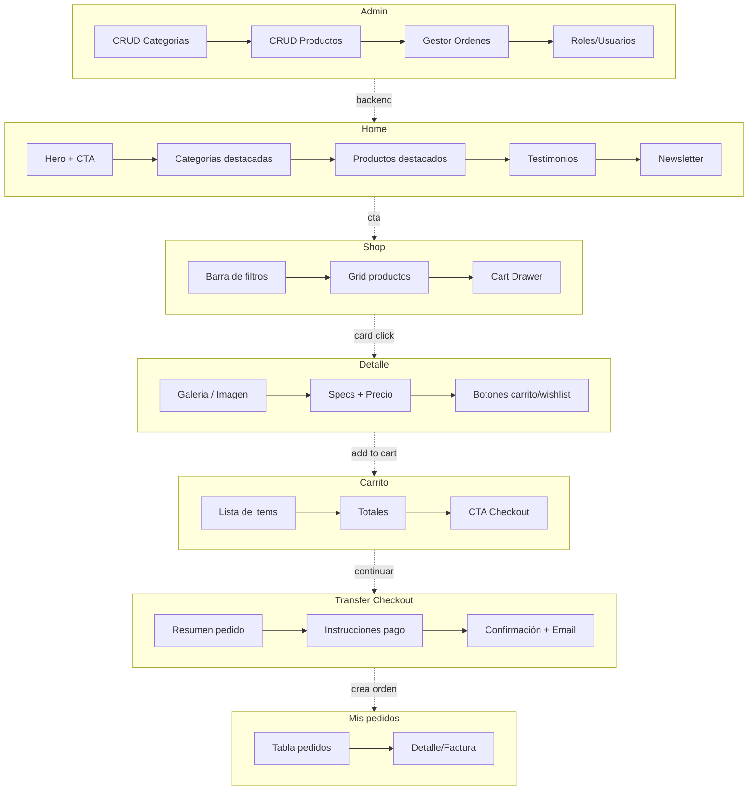

# Mockup funcional y mapeo de módulos

Este documento resume qué partes de la web corresponden a cada dominio descrito en `docs/architecture.md`, cómo se conectan entre sí y qué contratos/recursos usa cada módulo.

## Vista rápida del sitio (mockup textual)
- **Home**: hero, categorías destacadas, grid de productos destacados, testimonios, newsletter. (Dominios: Catálogo + Marketing/Contenido).
- **Shop**: listado/búsqueda de productos, filtros por categoría, cards con precio y stock, acceso rápido a wishlist y carrito. (Dominios: Catálogo + Inventario para stock + Carrito/Wishlist para acciones de usuario).
- **Product Detail**: ficha de producto, precio, stock, botón agregar a carrito/wishlist. (Dominios: Catálogo + Inventario + Carrito/Wishlist).
- **Cart / Checkout ligero**: resumen de ítems, cantidades, totales preliminares, paso a checkout/transferencia. (Dominios: Carrito/Wishlist + Checkout/Orquestación + Pagos cuando se confirme).
- **Orders / Invoice Detail**: listado y detalle de pedidos del usuario. (Dominios: Órdenes, Pagos para estados, Notificaciones para actualizaciones por email).
- **Account / Profile Edit / Auth**: login, registro, perfil, roles. (Dominios: Auth/Usuarios).
- **Admin**: gestión de categorías, productos, pedidos, usuarios. (Dominios: Catálogo, Inventario, Órdenes, Usuarios; lectura agregada para reportes).

## Módulos front y su dominio principal
- `src/pages/Index.tsx` (Home) → Catálogo (lectura) + Marketing.
- `src/pages/Shop.tsx` y `components/product/*` → Catálogo (productos, categorías) + Inventario (stock) + Carrito.
- `src/pages/ProductDetail.tsx` → Catálogo + Inventario + Carrito/Wishlist.
- `src/pages/Cart.tsx`, `components/shop/CartDrawer.tsx`, `stores/cartStore.ts` → Carrito/Wishlist + Checkout (cuando se confirma) + Pagos (intent de pago/transferencia).
- `src/pages/Orders.tsx`, `src/pages/InvoiceDetail.tsx` → Órdenes + Pagos.
- `src/pages/Auth.tsx`, `lib/auth-context.tsx`, `hooks/useRoles.ts` → Auth/Usuarios.
- `src/pages/admin/*` → Catálogo (categorías/productos), Órdenes, Usuarios/Roles; usa toasts para feedback.
- `components/layout/*`, `components/ui/*` → capa de UI compartida, sin lógica de dominio.

## Conexiones y contratos (actual)
- **Datos**: Supabase Postgres (tablas `products`, `categories`, `orders`, `order_items`, `profiles`, `user_roles`, `cart_items`, `saved_carts`).
- **Auth**: Supabase Auth; roles en tabla `user_roles` + hook `useRoles` para permisos.
- **Carrito**: `stores/cartStore.ts` mantiene estado local; `hooks/useSavedCart.ts` persiste en tabla `saved_carts` al loguear/actualizar.
- **Checkout/Transferencia**: `pages/TransferCheckout.tsx` orquesta flujo de pago por transferencia (usa órdenes + notificaciones por email via función de Supabase `send-order-email`).
- **Órdenes**: `pages/admin/AdminOrders.tsx` y `pages/Orders.tsx` leen/actualizan estado; se apoyan en RPC/funciones (`log_audit`, `generate_invoice_number`) y tabla `orders`.
- **Notificaciones**: Supabase Edge Function `supabase/functions/send-order-email` (usa Resend) suscribe a cambios de estado (invocada desde admin y checkout).

## Flujos clave (texto)
1) **Agregar al carrito**: Shop/ProductDetail → `useCart`/`cartStore` → `cart_items` (si logueado) + toasts.
2) **Guardar carrito en la nube**: `useSavedCart` carga `saved_carts` al login y fusiona con local; guarda en debounce cuando cambia `items`.
3) **Checkout/transferencia**: Carrito → `TransferCheckout` crea orden (tabla `orders`), registra items en `order_items`, envía email via función.
4) **Actualización de pedido**: Admin Orders cambia `status` → RPC `log_audit`, opcional crea factura (tabla `invoices` + `invoice_lines`), envía email con `send-order-email`, ajusta inventario vía lógica local (se planea mover a dominio Inventario según arquitectura).
5) **Gestión de catálogo**: Admin Categories/Products CRUD sobre `categories` y `products`; cuenta con toasts y validaciones básicas; pendiente mover a APIs por dominio.

## Mapeo a principios de la arquitectura
- Dominios ya visibles en front: Auth, Catálogo, Carrito/Wishlist, Órdenes, Pagos (transferencia), Notificaciones (correo), Admin/Reportes.
- Aislamiento de integraciones: función `send-order-email` actúa como adaptador de Notificaciones; Supabase actúa como adapter de persistencia.
- Contratos compartidos: en esta fase, los tipos se definen en `src/types/*` y hooks; roadmap sugiere mover a `shared/contracts` para reuso entre front y funciones.

## Trabajo pendiente según la arquitectura propuesta
- Extraer clientes HTTP por dominio (`src/shared/api/<dominio>.ts`) y zod schemas compartidos.
- Mover lógica de inventario (reservas) fuera del front a un servicio/función dedicada.
- Separar casos de uso (Checkout, Órdenes) en funciones Supabase independientes siguiendo el esquema `*-api`, `*-core`, `*-adapters`.
- Adoptar eventos de dominio (`order.updated`, `payment.succeeded`) para disparar notificaciones y ajustes de stock.
- Reorganizar el front a `src/features/*` por dominio, manteniendo UI compartida en `src/shared`.

## Wireframes rápidos (high-level)

Representación compacta de las vistas clave y sus dominios asociados.

- **Home**
	- Hero (CTA a Shop) — Catálogo
	- Grid de destacados (top N productos) — Catálogo
	- Testimonios / Newsletter — Marketing

- **Shop**
	- Barra de filtros (categoría, búsqueda) — Catálogo
	- Grid de cards (precio, stock) — Catálogo + Inventario
	- Acciones: wishlist / agregar carrito — Wishlist + Carrito

- **Product Detail**
	- Imagen + specs + precio — Catálogo
	- Stock visible — Inventario
	- Botones: Add to cart / wishlist — Carrito + Wishlist

- **Cart / Drawer**
	- Lista de ítems (qty, subtotal) — Carrito
	- CTA: Checkout / Transferencia — Checkout + Pagos

- **Transfer Checkout**
	- Resumen pedido, datos de pago, confirmación — Checkout + Órdenes + Pagos
	- Disparo de email — Notificaciones

- **Orders (usuario)**
	- Tabla de pedidos, estados, enlaces a factura — Órdenes + Pagos

- **Admin**
	- Categorías: CRUD — Catálogo
	- Productos: CRUD + stock — Catálogo + Inventario
	- Órdenes: cambio de estado, emails — Órdenes + Notificaciones
	- Usuarios/Roles: asignación — Auth/Usuarios

- **Auth / Perfil**
	- Login/Registro — Auth
	- Perfil editable — Auth/Usuarios

### Wireframes visuales (Mermaid)



	### Bocetos en Markdown (layout textual)

	```text
	HOME
	┌───────────────────────────────────────────────────────┐
	│ HERO: Copy + CTA + Imagen                             │
	├───────────────────────────────────────────────────────┤
	│ CATEGORÍAS DESTACADAS: [Suplementos] [Ropa] [Accesorios]
	├───────────────────────────────┬───────────────────────┤
	│ PRODUCTOS DESTACADOS          │ TESTIMONIOS           │
	│ [Card][Card][Card][Card]      │ “Muy buena calidad”   │
	├───────────────────────────────────────────────────────┤
	│ NEWSLETTER: input email + botón                        │
	└───────────────────────────────────────────────────────┘

	SHOP
	┌────────────┬──────────────────────────────────────────┐
	│ FILTROS    │ GRID PRODUCTS                            │
	│ - Búsqueda │ [Card][Card][Card]                       │
	│ - Categoría│ [Card][Card][Card]                       │
	│ - Precio   │ …                                        │
	├────────────┴──────────────────────────────────────────┤
	│ CART DRAWER (derecha): lista ítems + CTA              │
	└───────────────────────────────────────────────────────┘

	PRODUCT DETAIL
	┌───────────────────────────┬───────────────────────────┐
	│ GALERÍA / IMAGEN          │ INFO                      │
	│ [Img grande]              │ - Nombre, precio          │
	│ [Thumbs]                  │ - Descripción             │
	├───────────────────────────┤ - Stock disponible        │
	│ ACCIONES                  │ - Botones [Add cart][Wishlist]
	└───────────────────────────┴───────────────────────────┘

	CART / DRAWER
	┌───────────────────────────────────────────────────────┐
	│ ITEM #1   qty +/-   subtotal                          │
	│ ITEM #2   qty +/-   subtotal                          │
	├───────────────────────────────────────────────────────┤
	│ Totales: Subtotal / Descuentos / Total                │
	│ CTA: [Continuar a checkout]                           │
	└───────────────────────────────────────────────────────┘

	TRANSFER CHECKOUT
	┌───────────────────────────┬───────────────────────────┐
	│ RESUMEN PEDIDO            │ DETALLES DE PAGO          │
	│ - Lista items             │ - Datos transferencia     │
	│ - Totales                 │ - Upload comprobante (op) │
	├───────────────────────────┴───────────────────────────┤
	│ CTA confirmar + nota de email enviado                 │
	└───────────────────────────────────────────────────────┘

	ORDERS (usuario)
	┌───────────────────────────────────────────────────────┐
	│ Tabla: #Orden | Fecha | Estado | Total | Acción       │
	│ [Ver detalle] → factura / tracking                    │
	└───────────────────────────────────────────────────────┘

	ADMIN
	┌───────────────────────────────────────────────────────┐
	│ SIDEBAR: Dashboard, Productos, Categorías, Órdenes…   │
	├───────────────────────────┬───────────────────────────┤
	│ Tabla productos           │ Panel de acciones (crear/editar)
	├───────────────────────────┴───────────────────────────┤
	│ Órdenes (timeline) / Usuarios (roles)                 │
	└───────────────────────────────────────────────────────┘

	AUTH / PERFIL
	┌───────────────┐   ┌──────────────────────────────────┐
	│ Login form    │   │ Perfil: datos + contraseña        │
	└───────────────┘   └──────────────────────────────────┘
	```

## Referencias rápidas
- Arquitectura base: [docs/architecture.md](architecture.md)
- Notificaciones (email): [supabase/functions/send-order-email/index.ts](../supabase/functions/send-order-email/index.ts)
- Carrito persistente: [src/hooks/useSavedCart.ts](../src/hooks/useSavedCart.ts)
- Estado de carrito (local): [src/stores/cartStore.ts](../src/stores/cartStore.ts)
- Roles y auth: [src/hooks/useRoles.ts](../src/hooks/useRoles.ts) / [src/lib/auth-context.tsx](../src/lib/auth-context.tsx)
- Admin órdenes: [src/pages/admin/AdminOrders.tsx](../src/pages/admin/AdminOrders.tsx)
- Catálogo: [src/pages/Shop.tsx](../src/pages/Shop.tsx) / [src/pages/admin/AdminProducts.tsx](../src/pages/admin/AdminProducts.tsx)
- Categorías: [src/pages/admin/AdminCategories.tsx](../src/pages/admin/AdminCategories.tsx)
- Flujo de checkout transferencia: [src/pages/TransferCheckout.tsx](../src/pages/TransferCheckout.tsx)
